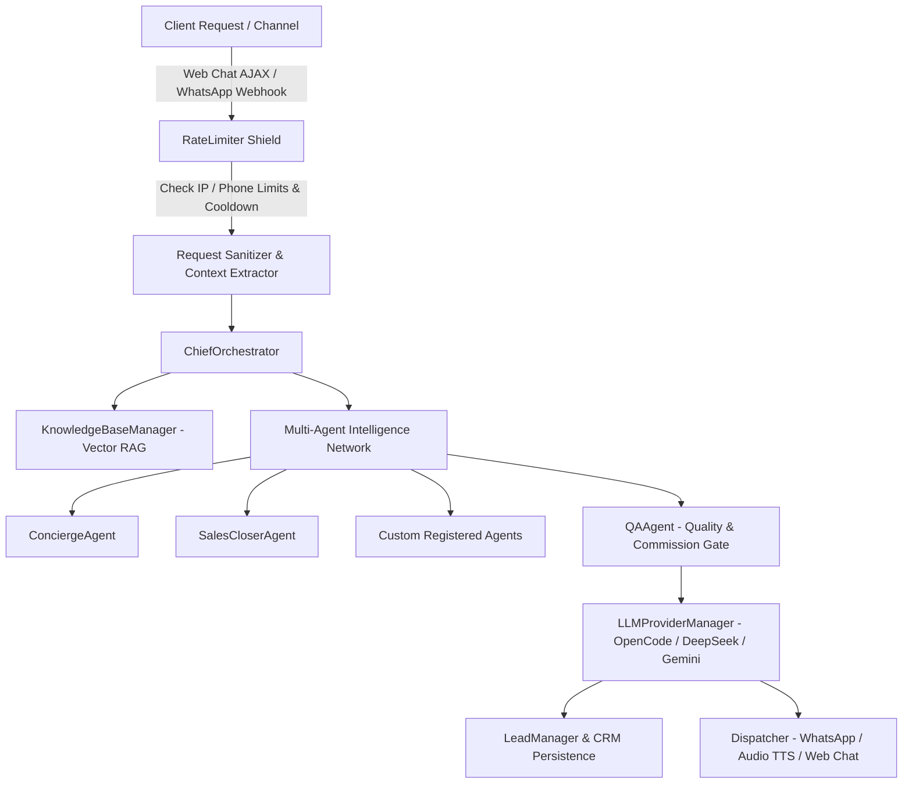

# 🏛️ RED SEA DIGITAL — System Architecture & Data Flow Guide
**Version:** 5.3.0 Enterprise Multi-Agent Architecture  
**Author:** Amr Ahmed, Founder & Lead Solutions Architect  
**Namespace:** `RedSea\*` (PSR-4 Autoloaded)

---

## 1. 🌐 Architectural Overview & Design Principles

The **RED SEA AI Engine** is an enterprise-grade, zero-SaaS-dependency WordPress AI infrastructure engineered for high-converting direct booking operations, luxury hospitality management, and automated outbound lead generation.



---

## 2. ⚡ End-to-End Data Flow Pipeline

### Step 1: Ingestion & Security Gate (`RedSea\Security\RateLimiter`)
* **Web Chat (`AjaxHandler::handle_chat`):** Validates client IP using Cloudflare/Reverse Proxy resolution (`check_ip_limit`). Enforces a maximum of **15 requests per 60 seconds** per visitor with HTTP 429 localized fallback.
* **WhatsApp (`WhatsAppGateway::handle_inbound_webhook`):** Validates sender phone (`check_phone_limit`) with a maximum of **20 messages per 60 seconds** to mitigate bot loops.

### Step 2: Intent Classification & Context Assembly (`RedSea\Orchestrator\ChiefOrchestrator`)
* Extracts session state, conversation history, and customer profile.
* Performs **Automatic Language Detection** (Arabic, English, German, Russian, French, Spanish).
* Evaluates dynamic sales personas (Text vs Spoken Voice Persona).

### Step 3: Semantic Knowledge Retrieval (`RedSea\RAG\KnowledgeBaseManager`)
* Queries `wp_rsd_vector_store` for domain knowledge chunks matching cosine similarity thresholds.
* Augments system instructions with curated studio dossiers, pricing structures, and hospitality guidelines.

### Step 4: Multi-Agent Synthesis & Quality Assurance (`RedSea\Agents\*`)
* Dispatches query to specialized agents via `AgentFactory`.
* **`QAAgent` Gate:** Reviews synthesized draft, strips hallucinations or unauthorized discounts, enforces 15–30% OTA commission elimination pitches, and formats clean output.

### Step 5: CRM Persistence & Outbound Dispatch (`RedSea\CRM\LeadManager` & `RedSea\Gateway\WhatsAppGateway`)
* Intercepts purchase/booking intent or detected phone numbers and logs lead to `wp_rsd_bookings` with anti-duplicate cooldown.
* Dispatches finalized copy via active channel (Meta Cloud API, Baileys Socket Bridge, or Web Speech Audio).

---

## 3. 🤖 Multi-Agent Matrix & Dynamic Extensibility

The system implements a Hierarchical Multi-Agent Architecture managed by `RedSea\Agents\AgentFactory`:

| Agent Name | Class | Primary Mission |
| :--- | :--- | :--- |
| **Chief Orchestrator** | `ChiefOrchestrator` | Central router, context arbitrator, and language detector |
| **Concierge Agent** | `ConciergeAgent` | High-touch luxury guest service & direct booking guidance |
| **Sales Closer Agent** | `SalesCloserAgent` | Commission-elimination pitches & discovery call scheduling |
| **QA / Anti-Hallucination**| `QAAgent` | Response validation, brand tone enforcement & sanitizer |
| **Lead Radar Engine** | `LeadRadarEngine` | Autonomous competitor gap analysis & outbound prospecting |
| **Custom Agents** | `AgentFactory::create_custom_agent()` | Dynamic user-defined agents configured via Admin Dashboard |

### How to Register a Custom Agent via Code:
```php
use RedSea\Agents\AgentFactory;

$agent = AgentFactory::create_custom_agent(
    'VIP Yacht Broker',
    'You are the Senior Yacht & Marine Experience Consultant for RED SEA DIGITAL.'
);
```

---

## 4. 📱 Dual-Engine WhatsApp Gateway Architecture

The gateway provides enterprise resilience by dynamically decoupling the transport mechanism:

```
                  ┌────────────────────────────────────────┐
                  │   WhatsAppGateway::send_message()      │
                  └──────────────────┬─────────────────────┘
                                     │
                 ┌───────────────────┴───────────────────┐
                 ▼                                       ▼
    [official_cloud]                        [local_bridge]
┌───────────────────────────────┐       ┌───────────────────────────────┐
│ Official Meta Cloud API       │       │ Local Socket / QR Bridge      │
│ - Graph API v19.0 Endpoint    │       │ - Evolution / Baileys WS      │
│ - Zero ban risk / Permanent   │       │ - Human Typing Delay (2-4.5s) │
│ - Enterprise & Hotel standard │       │ - Quick 8-Digit Pairing / QR  │
└───────────────────────────────┘       └───────────────────────────────┘
```

---

## 5. 🗄️ Database Schemas Managed by `RedSea\Database\SchemaManager`

All tables use WordPress table prefixing (`{$wpdb->prefix}rsd_*`) and are indexed for sub-millisecond retrieval:

1. **`wp_rsd_leads`:** Outbound prospecting dossiers, competitor gap analysis, and sales pitch tracking.
2. **`wp_rsd_bookings`:** Direct booking leads, contact phone numbers, and WhatsApp conversation details.
3. **`wp_rsd_vector_store`:** Semantic embeddings, document chunks, and RAG vector storage.
4. **`wp_rsd_telemetry_logs`:** AI model latency traces, token consumption, and status audits.

---

## 6. 📁 Directory Structure & Modularity

```text
redsea-ai-engine/
├── redsea-ai-engine.php         # Plugin Bootstrap & WordPress Lifecycle Hooks
├── composer.json                # PSR-4 Autoloading Definition
├── docs/
│   └── ARCHITECTURE.md          # Comprehensive Architectural Blueprint
├── src/
│   ├── Admin/
│   │   ├── AdminController.php  # Admin Dashboard & Menu Router
│   │   └── AjaxHandler.php      # Central AJAX Controller & Voice Streamer
│   ├── Agents/
│   │   ├── AgentFactory.php     # Factory Pattern for Multi-Agent Instantiation
│   │   ├── ConciergeAgent.php   # Guest Concierge Intelligence
│   │   ├── QAAgent.php          # Quality Assurance & Safety Filter
│   │   ├── RAGAgent.php         # Semantic Retrieval Agent
│   │   └── SalesCloserAgent.php # High-Conversion Closer
│   ├── CRM/
│   │   └── LeadManager.php      # CRM Data Layer & Webhook Dispatcher
│   ├── Database/
│   │   └── SchemaManager.php    # Central Database Migrations & Table Schemas
│   ├── Frontend/
│   │   └── FrontendManager.php  # Presentation Layer, CSS Injection & Footer
│   ├── Gateway/
│   │   └── WhatsAppGateway.php  # Dual-Engine Meta Cloud & Socket Gateway
│   ├── Orchestrator/
│   │   └── ChiefOrchestrator.php# Central Intelligence Coordinator
│   ├── Providers/
│   │   └── LLMProviderManager.php# Multi-LLM Gateway (OpenCode, DeepSeek, Gemini)
│   ├── RAG/
│   │   └── KnowledgeBaseManager.php# Vector Embeddings & Document Indexer
│   ├── Radar/
│   │   └── LeadRadarEngine.php  # Autonomous Market Discovery Engine
│   └── Security/
│       └── RateLimiter.php      # Sliding Window Transient Rate Limiter
└── templates/
    ├── admin/                   # 9 Decoupled Dashboard Tab Partials
    └── frontend/                # Frontend Partials (nuclear-css.php, chat-widget.php)
```
